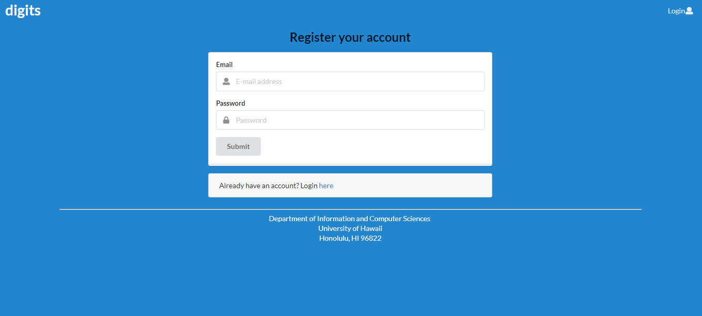
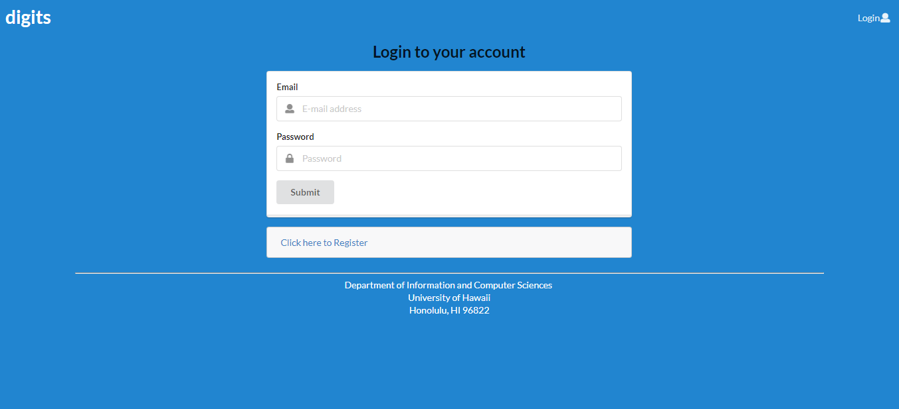
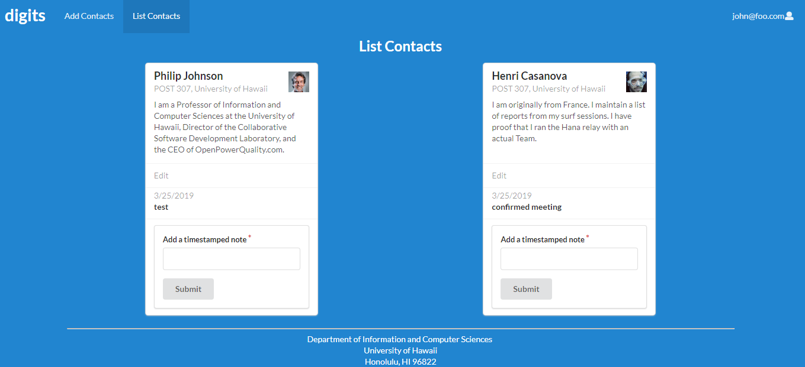
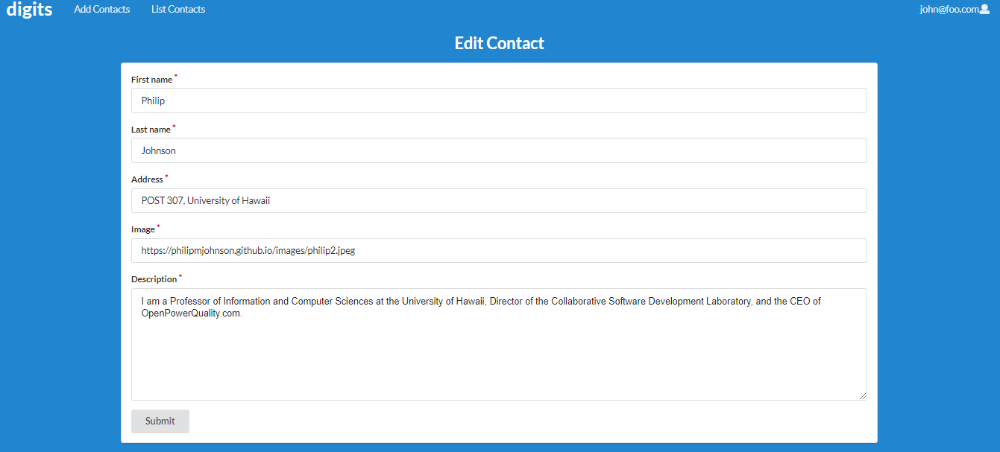

# Digits


Digits allows the user to
* Register an account
* Create/edit/delete contacts
* Add real-time notes for each contacts

#### Installation

* Install <a href="https://www.meteor.com/install">Meteor</a>
* Download a public repo of <a href="https://github.com/cruzjoshua/digits">Digits</a>

### Meteor Installation Commands

* Change directory to the app directory then →
```
meteor npm install
```
* After that →
```
meteor npm run start
```
* You will see a list of default users built in and a "bcrypt warning"
```
=> Started proxy.                             
=> Started MongoDB.                           
I20180305-18:06:02.764(-10)? Creating the default user(s)
I20180305-18:06:02.803(-10)?   Creating user admin@foo.com.
I20180305-18:06:02.803(-10)?   Creating user john@foo.com.
I20180305-18:06:02.804(-10)? Creating default contacts.
I20180305-18:06:02.804(-10)?   Adding: Johnson (john@foo.com)
I20180305-18:06:02.804(-10)?   Adding: Casanova (john@foo.com)
I20180305-18:06:02.804(-10)?   Adding: Binsted (admin@foo.com)
=> Started your app.

=> App running at: http://localhost:3000/
W20180305-18:06:02.805(-10)? (STDERR) Note: you are using a pure-JavaScript implementation of bcrypt.
W20180305-18:06:02.805(-10)? (STDERR) While this implementation will work correctly, it is known to be
W20180305-18:06:02.806(-10)? (STDERR) approximately three times slower than the native implementation.
W20180305-18:06:02.806(-10)? (STDERR) In order to use the native implementation instead, run
W20180305-18:06:02.806(-10)? (STDERR) 
W20180305-18:06:02.806(-10)? (STDERR)   meteor npm install --save bcrypt
W20180305-18:06:02.806(-10)? (STDERR) 
W20180305-18:06:02.806(-10)? (STDERR) in the root directory of your application.
```
You may ignore this warning.
* Lastly, run ESLint with →
```
meteor npm run lint
```

### User Interface Walkthrough
* Landing page: briefly describes the digit application →


* Register page: users can register their own account on the system →


* Sign in page: log in with your information →


* List contacts: shows your current contacts within your account →


You can also add timestamped notes to your contacts →


* Edit contacts: you can edit the contacts you have added →


### Admin Mode
You have to directly edit the settings file to add the Admin role to a user. With the "admin" role, you can view all the contacts that have been added by each "normal" user.
